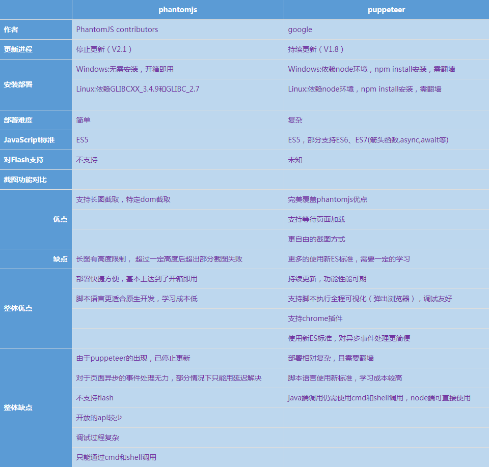

# Puppeteer实践
	主要应用场景：爬虫、UI自动化测试、页面性能检测

## NPM命令
	1、npm init --yes	初始化目录，执行后当前目录会出现package.json
	2、npm install xxx	安装依赖模块
	3、npm i --save puppeteer --ignore-scripts -g # 全局安装，i=install
	4、npm install -g cnpm --registry=https://registry.npm.taobao.org	配置taobao镜像
	5、cnpm i puppeteer -g

## 依赖模块说明
	1、puppeteer：Chrome的无界面版本及对其进行操控的js接口套装
	2、crypto：js加密模块

## 环境搭建说明
### Windows
	1、查看全局环境配置
		> npm config ls   #或者 npm config list
	2、修改全局配置
		npm config set prefix "E:\FRONT\nodejs\node_gobal" 		# 模块安装库
		npm config set cache "E:\FRONT\nodejs\node_cache"		# 缓存
	3、设置环境变量
		环境变量 > 系统变量下添加 NODE_PATH=[系统模块所在路径，如C:\Users\xxx\AppData\Roaming\npm\node_modules]
    4、全局模块安装及卸载
		npm install -g 模块名 	# 如 npm install -g cordova
		npm uninstall -g 模块名	# 如 npm uninstall -g cordova
	5、检查是否安装成功
		在cmd中输入node，进入编辑模式，输入 require('express')，没报错，说明全局设置成功。若报错，请检查环境变量NODE_PATH是否配置正确！
		输入 .exit 退出node环境
### CentOS7
#### 编译安装
	1、下载node安装包到指定目录	
		wget https://npm.taobao.org/mirrors/node/v11.0.0/node-v11.0.0.tar.gz
	2、解压安装包
		tar -zxvf node-v11.0.0.tar.gz
	3、进入目录并安装相关插件
		cd node-v11.0.0  && sudo yum install gcc gcc-c++
	4、进行默认配置并编译（编译大概需要半小时左右～）
		./configure	&& make
	5、安装
		sudo make install
	6、验证安装
		node -v
#### rpm包安装		
	1、下载rpm包源，不同版本不一样，具体参考 https://github.com/nodesource/distributions
		curl -sL https://rpm.nodesource.com/setup_11.x | bash -
	2、安装
		sudo yum install -y nodejs
	3、验证
		node -v
	提示：使用版本管理器n安装nodejs
		npm install -g n	# 安装n
		n list		# 查看所有版本
		n <version>	# 安装指定版本
		n rm <version> # 删除指定版本
		n latest	# 安装最新版本
		n stable	# 安装稳定版本
#### 环境配置
	1、查看系统配置
		npm config list
	2、全局安装puppeteer
		npm i --save puppeteer --ignore-scripts -g
	3、搜索node模块配置
		find / -name puppeteer
		结果：/usr/lib/node_modules/puppeteer	
	4、配置环境，并使其生效
		echo "export NODE_PATH=/usr/lib/node_modules/" >> /etc/profile
		source /etc/profile  或者 ./etc/profile
	5、验证是否生效
		输入node，进入编辑模式，输入 require('puppeteer')，没报错，说明全局设置成功。
		
	chromium下载地址：https://download-chromium.appspot.com/?platform=Linux_x64&type=snapshots
	在页面底部有各个平台版本选项 Windows(x86|x64)\ Mac\ Linux(x86|x64)...
	其他参考地址：https://chromium.woolyss.com/
	
	ssr客户端部署参考：https://blog.mrwang.pw/2018/12/13/Linux%E5%AE%89%E8%A3%85%E5%B9%B6%E4%BD%BF%E7%94%A8ssr/

## 基础参考地址
	1、Axios使用说明	https://www.kancloud.cn/yunye/axios/234845
	2、ES6之Array.from()使用方法	https://www.cnblogs.com/jf-67/p/8440758.html
	3、asyncjs的API	https://www.npmjs.com/package/asyncjs

## 实践参考地址	
	1、Puppeteer初始入门  http://www.r9it.com/20171106/puppeteer.html
	2、Puppeteer初探之前端自动化测试	https://cloud.tencent.com/developer/article/1006000
	3、Puppeteer-autotest	https://cnodejs.org/topic/5a041412ad77fa2004549183

## Github参考地址
1、[官网Github仓库](https://github.com/GoogleChrome/puppeteer)

2、[官网API接口地址，如各种类事件示例及整体说明文档](https://github.com/GoogleChrome/puppeteer/blob/master/docs/api.md)

3、[中文接口文档](https://zhaoqize.github.io/puppeteer-api-zh_CN/#/)

4、[爬取《es6标准入门》、自动推文到掘金、站点性能分析；高级爬虫、自动化UI测试、性能分析](https://github.com/zhentaoo/puppeteer-deep)

5、[介绍操作 Chrome 浏览器无头模式的工具库 Puppeteer](https://github.com/laispace/puppeteer-explore)

6、[模拟用户滑动验证](https://github.com/pureZjr/puppeteerDemo)

7、[nodejs爬取西瓜视频（今日头条视频）](https://github.com/jaxQin/node-spider)

8、[puppeteer autotest, 用puppeteer做页面自动化测试和restful接口测试.](https://github.com/dmoosocool/puppeteer-autotest)

9、[基于puppeteer的电商商品数据爬虫工具](https://github.com/xiongwilee/SkuSpider)

## phantomjs与puppeteer简单对比(截图功能)

## 截图效果

    